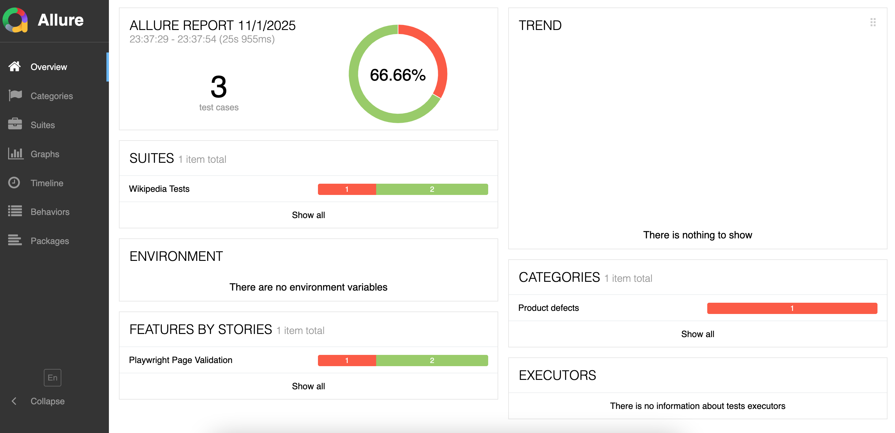
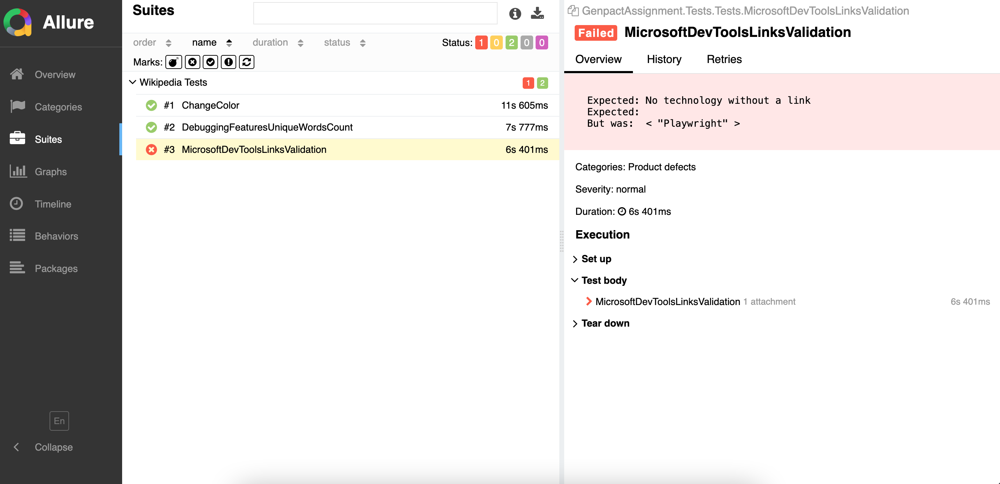

# Genpact Assignment

## Tech Stack
C#. 
Playwright. 
NUnit. 
Allure Report. 

## Project Structure
The project is divided into 3 layers:

           ┌────────────────────────────┐
           │        Test Cases          │
           │          (NUnit)           │
           └────────────┬───────────────┘
                        │
                        ▼
           ┌────────────────────────────┐
           │       Steps Layer          │
           │  (Business flows / Actions)│
           └────────────┬───────────────┘
                        │
                        ▼
           ┌────────────────────────────┐
           │     Infra/POM Layer        │
           │(Page Objects / API Clients)│
           └────────────────────────────┘

The idea is a separation of responibilities and abstraction. Each layer can talk only to the layers one level above or below it. 
No duplication of code using POM for the UI tests and the steps.

## Results
There are 3 tests for each of the tasks.
Task 2 fails by definition (for the sake of the task), since Playwright is not a traditional link (self link),
and the login is based upon href links and list elements.

The code compiles without warnings.
ChatGPT was used for some parts (since it was allowed). For example, the ApiClient and parts of the WikipediaClient (API).

### Allure Report
The allure report was integrated.  

To generate the report:
Run the tests: dotnet test
Generate the report: allure generate bin/Debug/net9.0/allure-results --clean -o allure-report
Open the report: allure open allure-report

Examples:

